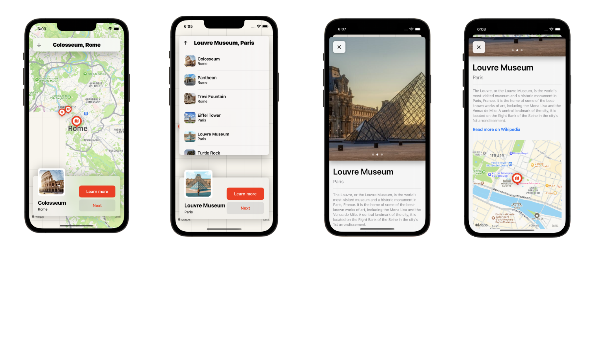

# Locations - A Tourist Sites Discovery App

## Description

*Locations* is an app that allows users to discover a list of tourist sites on a map, smoothly scroll through these sites, view detailed descriptions for each of them, and even redirect to a website for more information about the tourist sites.

## Key Features

- ✅ Display tourist sites on an interactive map.
- ✅ Smooth navigation between different tourist sites.
- ✅ Show comprehensive details for each tourist site.
- ✅ Ability to redirect to external websites for more information.
- ✅ User-friendly and intuitive user interface, built with SwiftUI.

## Screenshots

## Requirements

- iOS 14 or later
- Compatible with iPhone and iPad.

## Tech Stack

- Swift
- Swift UI

## License

Released under the MIT License. Feel free to use, modify, and distribute this project according to the terms of the license.